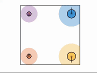

# Safe Navigation in Dynamic Environments using Density Functions
This work presents a density-based framework for safe navigation in dynamic environments characterized by time-varying obstacle sets and time-varying target regions. We propose an analytical construction of time-varying density functions that enables the synthesis of a feedback controller defined as the positive gradient of the resulting density field. The primary contribution of this paper is a rigorous convergence proof demonstrating almost-everywhere safe navigation under the proposed framework, specifically for systems governed by single-integrator dynamics. To the best of our knowledge, these are the first analytical guarantees of their kind for navigation in dynamic environments using density functions. We illustrate the applicability of the framework to systems with more complex dynamics, including multi-agent systems and robotic manipulators, using standard control design techniques such as backstepping and inverse dynamics. These results provide a foundation for extending density-based navigation methods to a broad class of robotic systems operating in time-varying environments.

# Density functions
Density functions are a physically intuitive way to solve almost everywhere (a.e.) safe navigation problems.

  

Inverse bump function: (a) top view showing contours and (b) 3D view.

We exploit the occupancy-based interpretation of density in constructing analytical expressions for time-varying density functions.

  

(a) Density function defined on an environment with a circular unsafe set and a point target, (b) Corresponding occupancy measure obtained using trajectories from 100 initial conditions sampled within the initial set.

# Multiagent Systems
Four agent scenario where two agents are bigger than the other agents

  

Six agent scenario where all the agents are the same size

  

# Robotic Arm
Safe trajectory tracking of a robotic arm while avoinding obstalces

  

