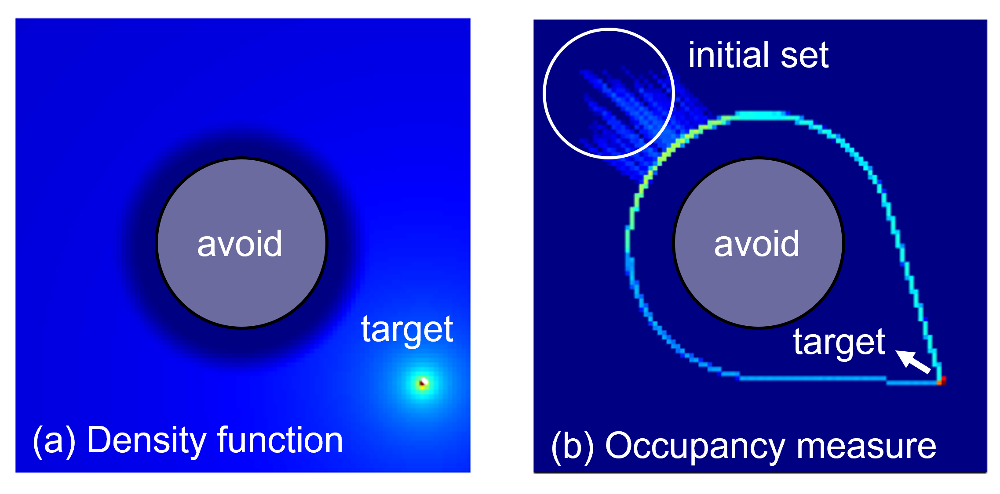
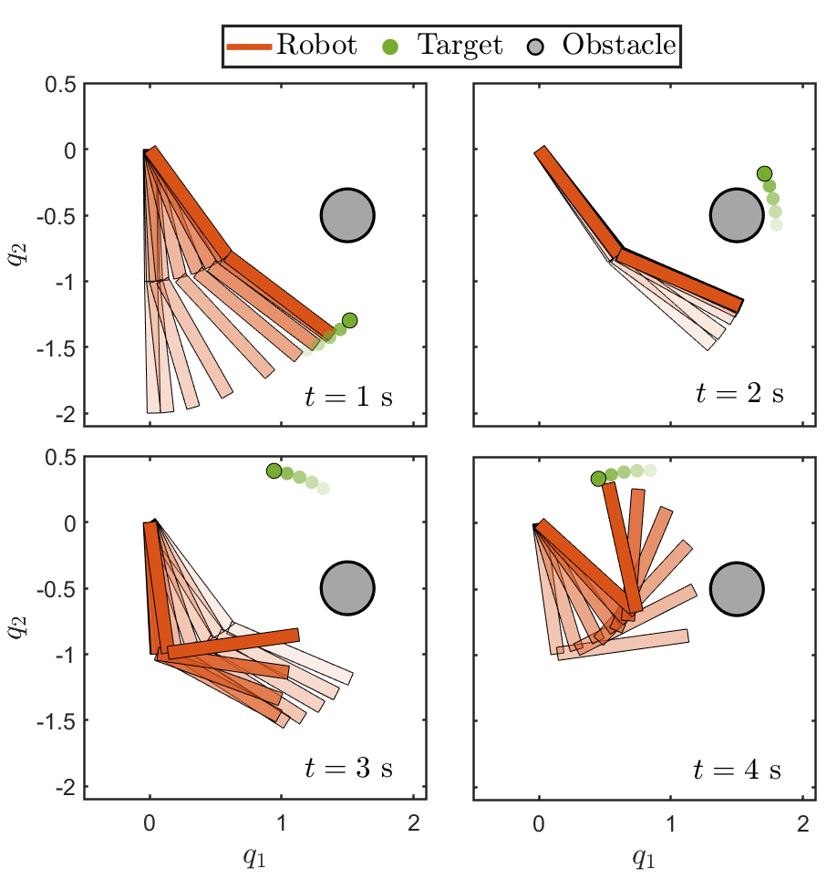

# Safe Navigation in Dynamic Environments using Density Functions
This work uses density functions for safe navigation in dynamic environments. The dynamic environment consists of time-varying obstacles as well as time-varying target sets. We propose an analytical construction of time-varying density functions to solve these navigation problems. The proposed approach leads to a time-varying feedback controller obtained as a positive gradient of the density function. This paper's main contribution is providing convergence proof using the analytically constructed density function for safe navigation in the presence of a dynamic obstacle set and time-varying target set. The results are the first of this kind developed for a system with integrator dynamics and open up the possibility for application to systems with more complex dynamics using methods based on control density function and inverse kinematic-based control design. We present the application of the developed approach for collision avoidance in multi-agent systems and robotic systems. While the theoretical results are produced for first-order integrator systems, we demonstrate how the framework can be applied for systems with non-trivial dynamics, such as Dubin's car model and fully actuated Euler-Lagrange system with robotics applications.

# Density functions
Density functions are a physically intuitive way to solve almost everywhere (a.e.) safe navigation problems.

  

Inverse bump function: (a) top view showing contours and (b) 3D view.

We exploit the occupancy-based interpretation of density in constructing analytical expressions for time-varying density functions.

  

(a) Density function defined on an environment with a circular unsafe set and a point target, (b) Corresponding occupancy measure obtained using trajectories from 100 initial conditions sampled within the initial set.

# Mutliagent Systems

  

# Robotic Arm

  

